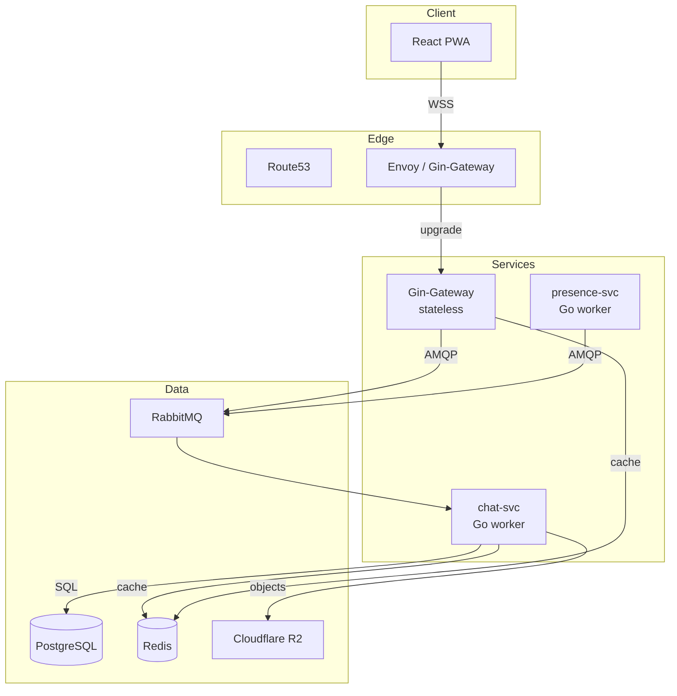

# System Architecture Overview

## Goal
Real-time messaging service ("Mini-Telegram") supporting 10 k concurrent sockets, <200 ms p99 delivery, 6 MB static binary, zero-downtime deploy.

## Core Components
1. **gin-gateway** (stateless)
   - Upgrade to WebSocket, JWT auth, keep-alive, fan-out to clients
   - Registers `conn:<uid>:<device>` in Redis (TTL 35 s)
   - Subscribes to RabbitMQ `delivery` exchange (topic per chat)

2. **chat-svc** (stateless Go worker)
   - Consumes `chat.<chatId>` queue
   - Persists message to Postgres (GORM)
   - Reads member list from Redis `grp:<chatId>`
   - Publishes delivery event to `delivery` exchange

3. **presence-svc** (stateless Go worker)
   - Consumes `presence` queue for receipts & last-seen
   - Batches read receipts, updates Postgres
   - Updates Redis presence key `pres:<uid>`

4. **postgres** - single writer, optional read-replica
5. **redis** - Upstash serverless (conn, presence, group members)
6. **rabbitmq** - durable queues, lazy queues enabled, quorum queues for HA
7. **object-storage** - Cloudflare R2 (media, keys)
8. **prometheus + grafana** - metrics, alerting

## Data Flow (Happy Path)
```
Client ─WSS─► Gateway ─AMQP──► chat-svc ─SQL──► DB
  ▲                            │
  │                            └──AMQP──► delivery ──► Gateway ──► Client
  └──ACK──────────────────────────────────────────────────────────────┘
```

## Text-based Sequence
```
Client-A          Gateway        chat-svc       Postgres      Redis
   |                |              |              |            |
   |--SendMessage-->|              |              |            |
   |                |--publish---->|              |            |
   |                |              |--INSERT---->|            |
   |                |              |--getMembers------------>|
   |                |<--delivery---|              |            |
   |<--Delivered----|              |              |            |
```

## Service Boundaries
| Service | API Surface | Storage | Owner |
|---------|-------------|---------|-------|
| gin-gateway | WebSocket + REST /auth | Redis conn | Gateway |
| chat-svc | AMQP consumer | Postgres | Chat |
| presence-svc | AMQP consumer | Postgres + Redis | Presence |

## Technology Justification
- **Go 1.22** - 20 MB RSS, static binary, 25 k goroutines/core
- **Gin** - fastest HTTP router, minimal boilerplate
- **gorilla/websocket** - battle-tested, RFC 6455
- **RabbitMQ** - durable, lazy queues, quorum queues, easy local dev
- **Postgres** - ACID, window functions, GORM migration
- **Redis** - sub-ms presence lookups
- **k3s** - full K8s API with 50% memory footprint

## Scalability Patterns
- Stateless gateways → HPA on CPU 60%
- Topic-per-chat sharding in RabbitMQ (10 k topics)
- Connection registry sharded by `uid % 64` in Redis cluster
- DB read-replica for history pagination
- Binary protobuf frames → 5× smaller than JSON

## Known Bottlenecks
1. Postgres write on `messages` table >50 k writes/s → solution: partitioning by hash(chat_id)
2. RabbitMQ queue growth during spike → enable lazy queues, TTL 24 h
3. Redis hot key for big groups → split to Redis cluster + hash-tag `{chatId}`

## Visual Diagram (Mermaid)

