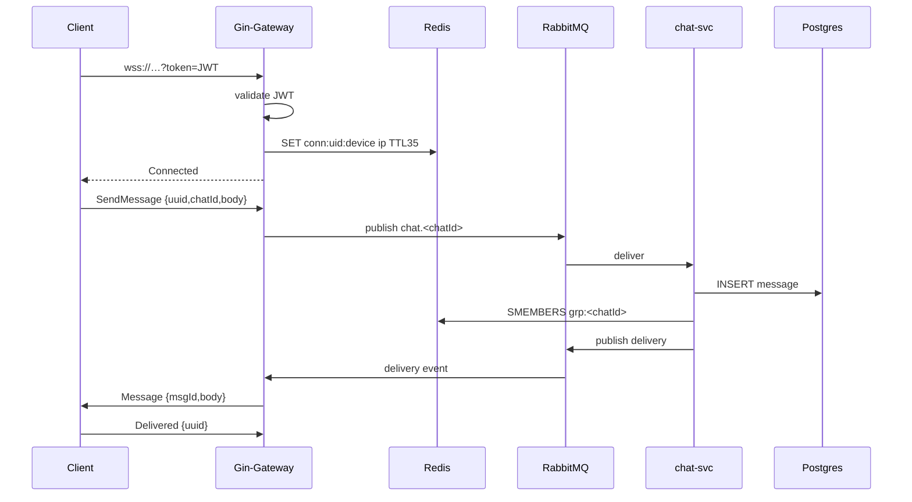

# WebSocket Protocol

## Connection Lifecycle
1. Client opens `wss://api.myapp.com/v1/ws?token=<JWT>`
2. Gateway validates JWT → HTTP 401 if invalid
3. Upgrade success → register `conn:<uid>:<device>` in Redis TTL 35 s
4. Heart-beat: piggy-back on WS Ping/Pong every 30 s (RFC 6455)
5. Either side can send Close frame (code 1000)

## Message Types (protobuf)
Upstream (client→server):  
`SendMessage`, `Read`, `Ping`

Downstream (server→client):  
`Message`, `Delivered`, `Presence`, `Pong`

## Frame Format
Binary frame (opcode 2) containing protobuf bytes.  
Fallback: text frame (opcode 1) with JSON for debugging.

## Client Reconnection
- Exponential backoff: 1 s → 2 s → 4 s … max 60 s  
- Random jitter ±20 %  
- Re-use fresh JWT via `/v1/auth/refresh` cookie  
- Replay un-acked messages with same uuid (idempotency)

## Server Connection Registry
Redis key: `conn:<uid>:<device> = <gwPodIp>` TTL 35 s  
Updated on every Ping frame.  
Gateway subscribes to RabbitMQ `delivery` queue filtered by local pod IP.

## Fan-out Routing
chat-svc publishes to `delivery` exchange with routing key `<chatId>`  
Gateway binds queue with key list = all chats having local sockets → no broadcast.

## Visual Sequence (Mermaid)

